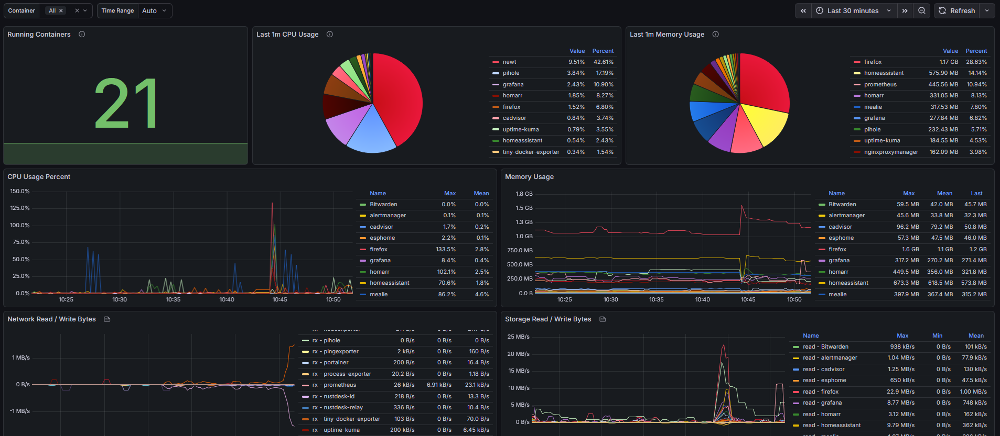

# Tiny Docker Exporter

An extremely lightweight Prometheus metrics exporter for Docker container statistics, written in Go.

## Features

- **Minimal footprint**: ~52.6MB Docker image (Alpine + docker CLI + compiled Go binary)
- **Zero external Go dependencies**: Uses only Go standard library
- **Prometheus-compatible**: Exposes metrics in standard Prometheus text format
- **Low resource usage**: ~10-15MB memory per exporter container
- **Fast**: Sub-20ms response time for metrics endpoint
- **Comprehensive**: 9 metrics per container covering CPU, memory, network, I/O, and process counts

## Metrics Exposed

- `docker_container_cpu_percent` - CPU percentage
- `docker_container_memory_usage_bytes` - Current memory usage
- `docker_container_memory_limit_bytes` - Memory limit
- `docker_container_memory_percent` - Memory percentage
- `docker_container_network_input_bytes` - Network input
- `docker_container_network_output_bytes` - Network output
- `docker_container_block_input_bytes` - Block device input
- `docker_container_block_output_bytes` - Block device output
- `docker_container_pids` - Number of processes

## Building

```bash
docker build -t tiny-docker-exporter:latest .
```

## Running

```bash
docker run -d \
  -v /var/run/docker.sock:/var/run/docker.sock \
  -p 8010:8010 \
  tiny-docker-exporter:latest
```

The exporter will listen on port `8010` and expose metrics at `http://localhost:8010/metrics`.

## Prometheus Configuration

Add to your `prometheus.yml`:

```yaml
scrape_configs:
  - job_name: 'docker-exporter'
    static_configs:
      - targets: ['localhost:8010']
```

## Health Check

A health endpoint is available at `http://localhost:8010/health`.

## Performance

- **Image size**: 52.6MB (Alpine Linux + docker CLI + Go binary)
- **Memory usage**: ~36-37MB while running (measured with 21 monitored containers)
- **CPU usage**: Minimal (only when collecting stats every 2 seconds)
- **Response time**: <20ms for metrics endpoint
- **Collection interval**: 2 seconds (hardcoded)
- **Port**: 8010 (default, configurable via command argument: `./exporter 9999`)
- **Containers supported**: Unlimited (tested with 20+ containers)

## Testing

A comprehensive test suite is included to verify the exporter is working correctly:

```bash
# Run tests
./test.sh
```

The test suite verifies:
- Docker image exists and is accessible
- Container starts and runs successfully
- Health endpoint responds correctly
- Metrics endpoint returns properly formatted Prometheus metrics
- All 9 metric types are present
- Metric values are numeric and valid
- Memory usage is within acceptable range
- Response time is acceptable
- All running containers are discovered and monitored

## Building from Source

```bash
git clone https://github.com/jjeuriss/tiny-docker-exporter.git
cd tiny-docker-exporter
docker build -t tiny-docker-exporter:latest .
```

## Docker Compose Example

```yaml
services:
  docker-exporter:
    image: ghcr.io/jjeuriss/tiny-docker-exporter:latest
    container_name: docker-exporter
    restart: unless-stopped
    ports:
      - "8010:8010"
    volumes:
      - /var/run/docker.sock:/var/run/docker.sock:ro
    mem_limit: 100m
```

Then add to your Prometheus `scrape_configs`:

```yaml
scrape_configs:
  - job_name: 'docker-exporter'
    static_configs:
      - targets: ['localhost:8010']
    scrape_interval: 10s
    scrape_timeout: 5s
```

## Grafana Dashboard

A pre-built Grafana dashboard is included for visualizing Docker container metrics. See [GRAFANA_SETUP.md](./GRAFANA_SETUP.md) for complete setup instructions.



**Dashboard features**:
- Running container count (stat panel)
- CPU usage pie charts (last $range average) and time series (real-time)
- Memory usage pie charts (last $range average) and time series (real-time)
- Network I/O graphs (input/output bytes with rate analysis)
- Block I/O graphs (input/output bytes with rate analysis)
- Process count trends (PIDs over time)
- Multi-container filtering via dropdown variable
- Adjustable time range analysis ($range variable)
- Shared tooltip on hover across all panels for correlation

## Contributing

Contributions welcome! Please feel free to submit PRs or open issues.

## License

MIT
